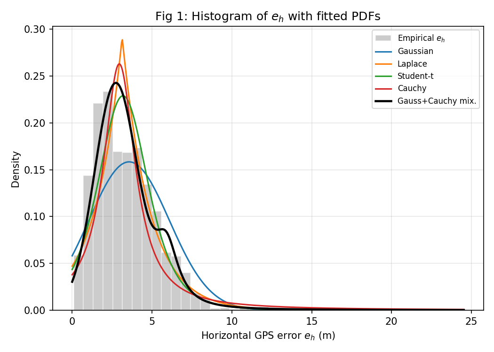
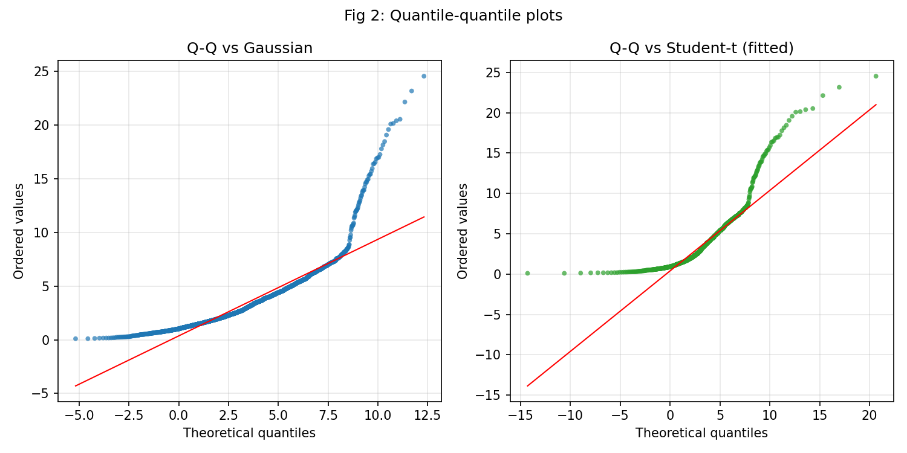
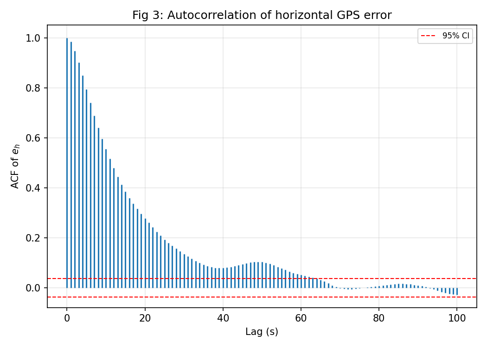
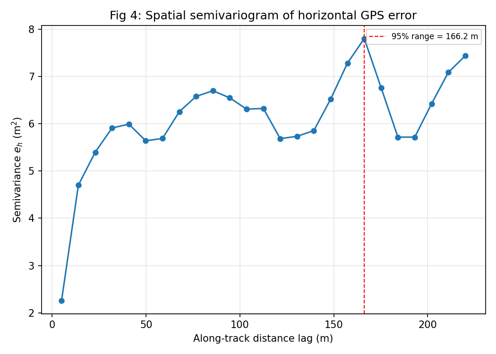
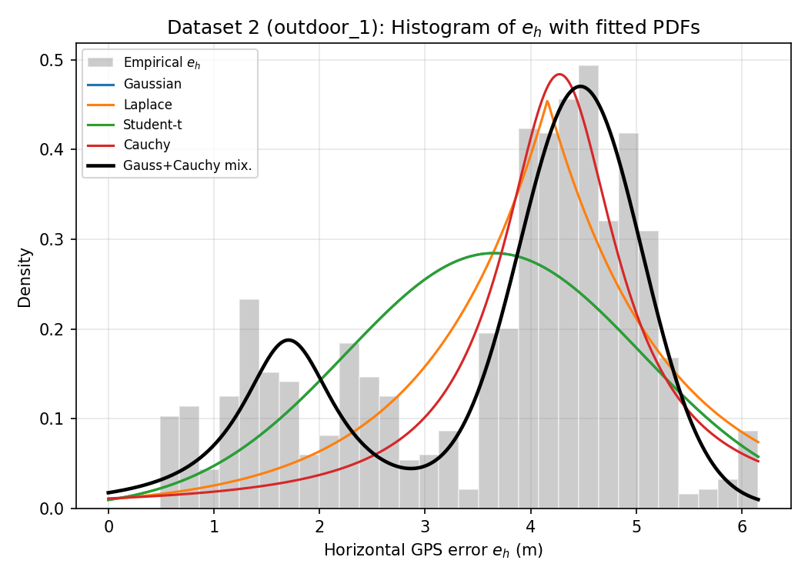
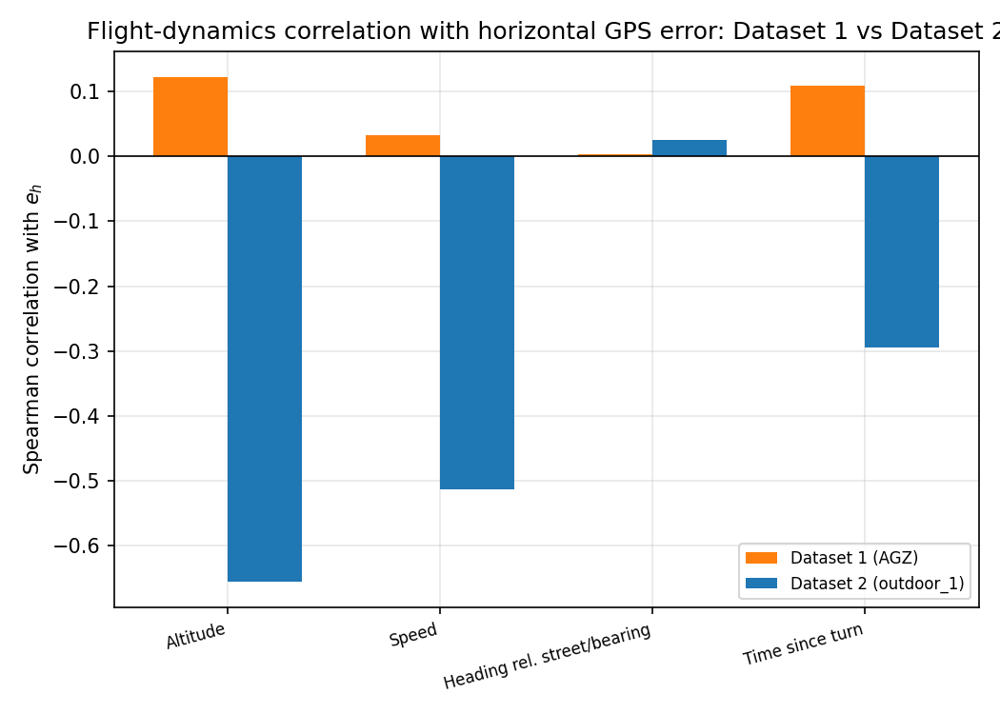
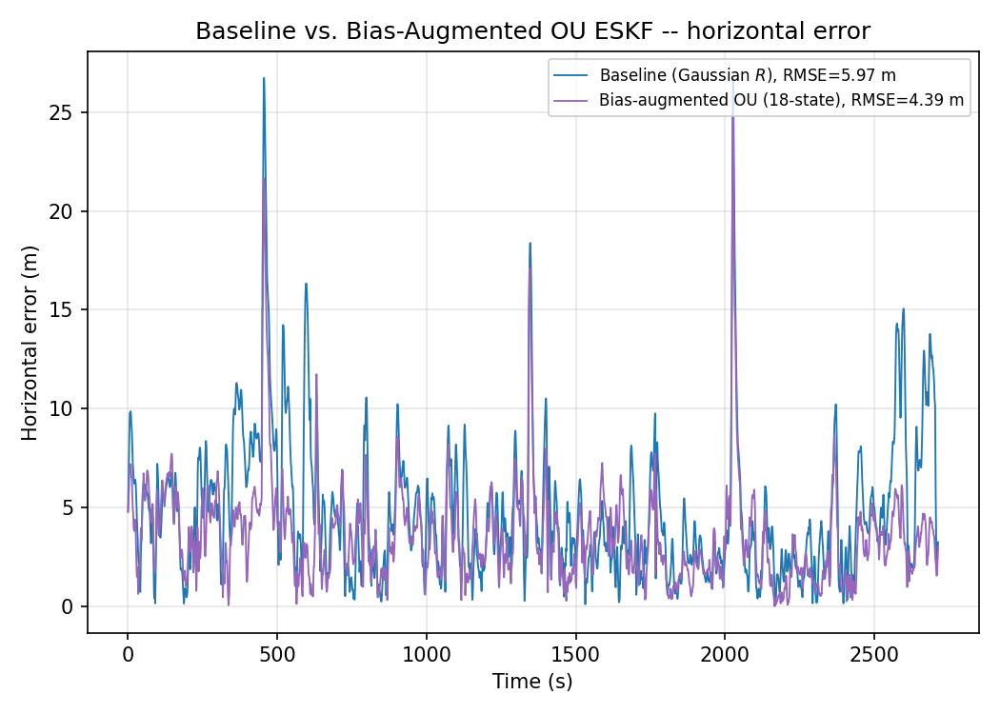
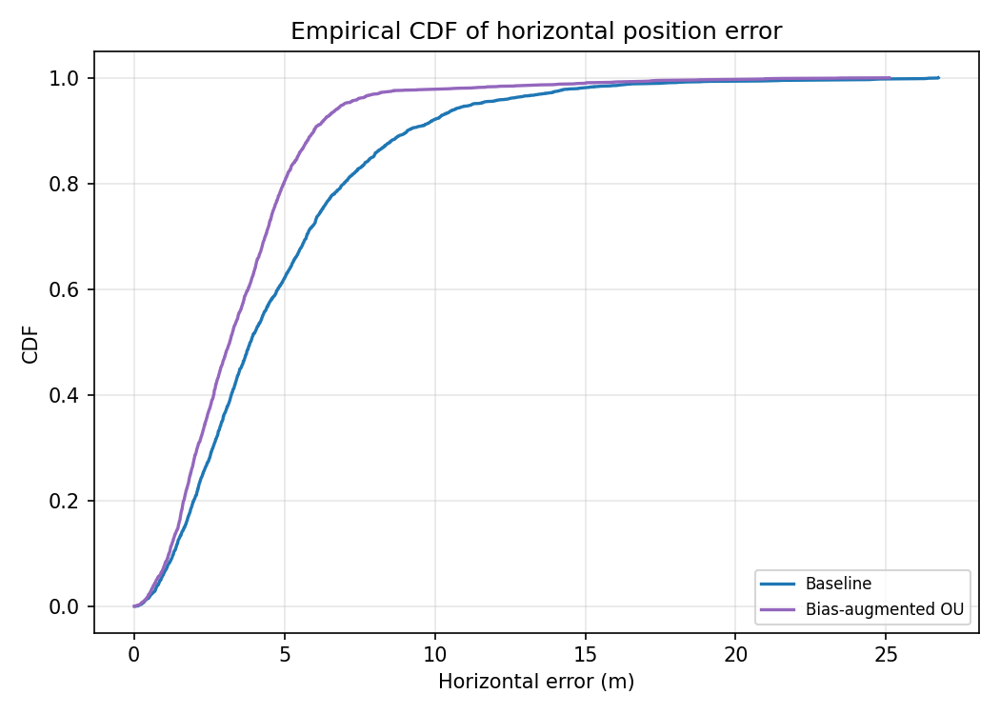
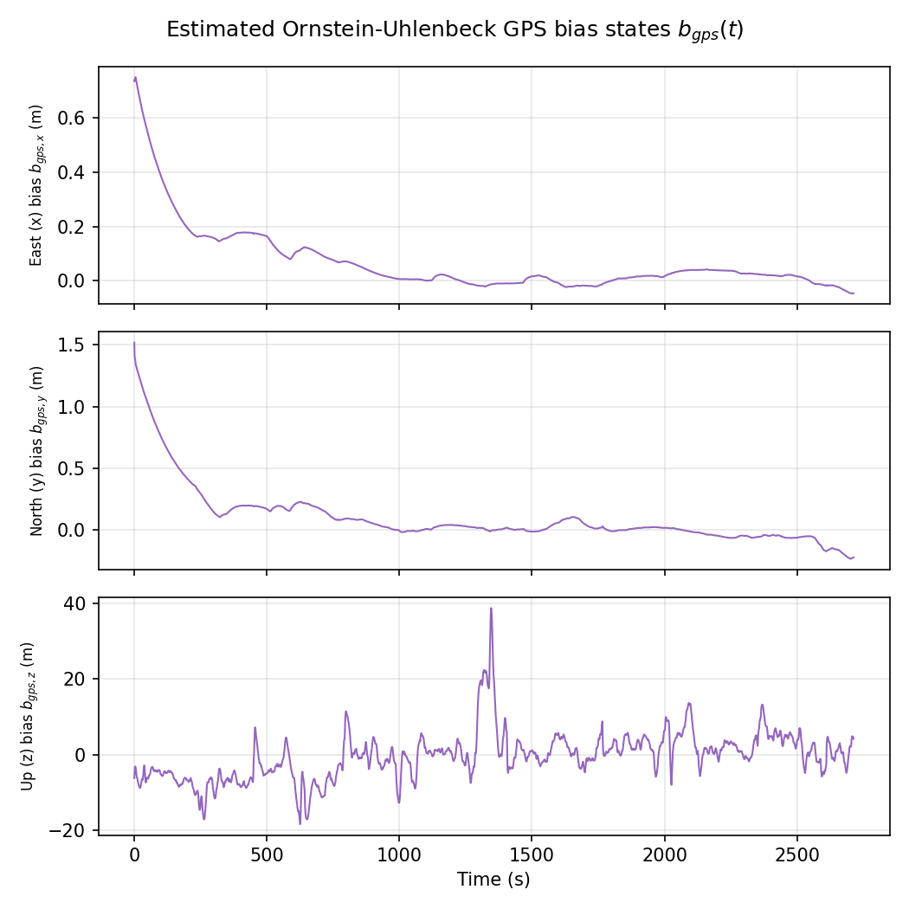
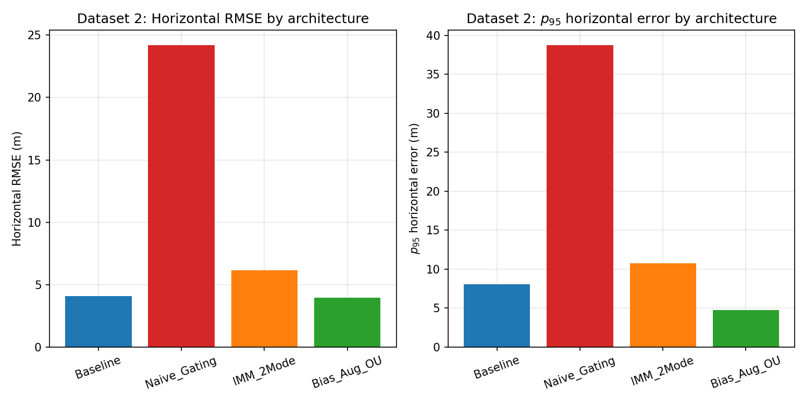

# Beyond the Bell Curve: Urban GPS Multipath Characterization & Heavy-Tailed Filtering for MAVs

Companion code for the paper *"Beyond the Bell Curve: Characterizing Urban GPS
Multipath for MAV Navigation and the Limits of Heavy-Tailed Filtering"*
(`paper/paper.pdf`, `paper/paper.tex`). This repo reproduces every table and
figure from raw per-epoch error data and saved filter output. Figure
filenames match `paper.tex`'s `\includegraphics` calls exactly, so the
`paper/figures/` folder can be used to recompile the PDF directly.

- **Part 1** — statistical characterization of the AGZ (Zurich) dataset
- **Part 2** — statistical characterization of the INSANE `outdoor_1` dataset (cross-validation)
- **Part 3** — baseline EKF vs. three GPS-error-aware filter architectures, both datasets

## Quick start

```bash
pip install -r requirements.txt
cd part1_dataset1_AGZ_characterization && python characterize_dataset1.py && cd ..
cd part2_dataset2_outdoor1_characterization && python characterize_dataset2.py && cd ..
cd part3_filtering_results && python filtering_results.py && cd ..
```

Run Part 1 before Part 2 — Part 2's cross-dataset bar chart
(`cross_fig_regression_bar.png`) picks up Part 1's own Table II output if
present, falling back to paper-reported AGZ values otherwise.

## Repository layout

```
.
├── README.md                           ---
├── requirements.txt
├── LICENSE
├── paper/
│   ├── paper.pdf
│   ├── paper.tex                               
│
├── part1_dataset1_AGZ_characterization/
│   ├── characterize_dataset1.py
│   ├── zurich_gps_error.csv
│   ├── figures/
│   │   ├── fig1_hist_pdf.png
│   │   ├── fig2_qq.png
│   │   ├── fig3_acf.png
│   │   └── fig4_semivariogram.png
│   └── tables/     table1_distribution_fit.csv, table2_flight_dynamics_correlation.csv
│
├── part2_dataset2_outdoor1_characterization/
│   ├── characterize_dataset2.py
│   ├── dataset2_gps_error.csv
│   ├── figures/
│   │   ├── d2_fig1_hist_pdf.png
│   │   ├── d2_fig3_acf.png
│   │   ├── d2_fig4_semivariogram.png
│   │   └── cross_fig_regression_bar.png
│   └── tables/     table1_distribution_fit_dataset2.csv, table2_..._dataset2.csv, table3_cross_dataset_comparison.csv
│
└── part3_filtering_results/
    ├── filtering_results.py
    ├── data/
    │   ├── dataset1/   baseline_results.npz, bias_results.npz
    │   └── dataset2/   d2_{baseline,gating,imm,ou}_results.npz
    ├── figures/
    │   ├── fig8_filter_comparison.png            static (see note below)
    │   ├── fig9_biasou_horiz_error.png
    │   ├── fig11_biasou_cdf.png
    │   ├── fig10_estimated_bias.png
    │   ├── d2_fig9_filter_comparison.png
    │   ├── d2_fig10_ou_comparison.png
    │   ├── d2_fig11_bias_states.png
    │   └── d2_fig12_rmse_bar_comparison.png
    └── tables/     table4_agz_filtering_results.csv, table5_outdoor1_filtering_results.csv
```

Each `*_results.npz` stores per-epoch filter output: `t` (time), `err`
(3-axis position error, m), `nees`/`p` (covariance-consistency diagnostics),
and `bias` (estimated OU bias states, OU filter only).

**Note on `fig8_filter_comparison.png` (AGZ naive-gating/IMM comparison):**
this one figure is shipped as a static, pre-rendered file rather than
regenerated by `filtering_results.py`, because the per-epoch arrays for the
AGZ naive-gating and AGZ IMM runs (`naive_gating_results.npz`,
`imm_results.npz`) aren't part of this repo's saved data — only
`baseline_results.npz` and `bias_results.npz` exist for AGZ. If you rerun
those two filters and save their output in `data/dataset1/`, extend the
script to regenerate this figure from real data too.

---

## 1. Problem setup

An EKF fusing INS + GPS needs a noise model for the GPS measurement update.
The standard choice is stationary white Gaussian noise (WGN). In urban
canyons, GPS multipath — signals bouncing off building facades before
reaching the receiver — breaks both assumptions the WGN model needs:
errors become **heavy-tailed** and **temporally/spatially correlated**.

$$e_{h,i} = \sqrt{e_{x,i}^2 + e_{y,i}^2}, \qquad e_{\cdot,i} = \text{GPS}_i - \text{GroundTruth}_i$$

## 2. Part 1 & 2 — Characterization (Phases 1–3)

### Phase 1 — Distribution fitting

$$f_{\text{mix}}(e) = w \cdot \mathcal{N}(e; \mu_g, \sigma_g^2) + (1-w) \cdot \text{Cauchy}(e; x_0, \gamma)$$

fit by MLE (Nelder–Mead for the Cauchy/mixture terms, since the Cauchy's
undefined variance destabilizes gradient methods), ranked by

$$\text{AIC} = 2k - 2\ln\hat L, \qquad \text{BIC} = k\ln N - 2\ln\hat L$$

and checked with the Kolmogorov–Smirnov statistic $D = \sup_x |F_N(x) - F(x;\hat\theta)|$.

**Result (AGZ):** the Gaussian+Cauchy mixture wins on every criterion (ΔAIC ≈ 1200).

<p align="center">


</p>

### Phase 2 — Correlation analysis

$$\rho(\tau) = \frac{\text{Cov}(e_h(t), e_h(t+\tau))}{\text{Var}(e_h(t))}, \qquad
\gamma(h) = \frac{1}{2|N(h)|}\sum_{(i,j)\in N(h)} \left(e_h(s_i) - e_h(s_j)\right)^2$$

**Result (AGZ):** lag-1 autocorrelation ≈ **0.984**, spatial correlation range ≈**160 m**.

<p align="center">


</p>

### Cross-validation on `outdoor_1` (Part 2)

The heavy-tailed mixture and lag-1 ≈ 0.984 autocorrelation **replicate**,
while spatial correlation range and geometry-vs-dynamics balance are
**environment-specific**.

<p align="center">


</p>

## 3. Part 3 — Filtering architectures

Baseline **15-state error-state EKF** (attitude + barometric aided):

$$\delta x = [\delta p,\ \delta v,\ \delta\theta,\ \delta b_a,\ \delta b_g]^\top \in \mathbb{R}^{15}$$

Three GPS-error-aware variants tested against it: (1) naive outlier
gating/inflation, (2) 2-mode Gaussian-Sum/IMM, (3) an **18-state
bias-augmented ESKF** modeling GPS error as a per-axis Ornstein–Uhlenbeck
process:

$$\dot b_i(t) = -\tfrac{1}{\tau_i} b_i(t) + w_i(t), \qquad \delta x = [\delta p,\delta v,\delta\theta,\delta b_a,\delta b_g,\ b_{\text{gps}}]^\top \in \mathbb{R}^{18}$$

with $\tau_i$ fit from the Phase-2 ACF (15.8–42.9 s on AGZ).

### Results (data-derived, matches `tables/table4_agz_filtering_results.csv` / `table5_outdoor1_filtering_results.csv`)

| Metric | AGZ Baseline | AGZ Bias-Aug. OU | outdoor_1 Baseline | outdoor_1 Bias-Aug. OU |
|---|---|---|---|---|
| RMSE horiz. (m) | 5.97 | **4.39 (−26.5%)** | 4.06 | **3.95 (−2.9%)** |
| p95 horiz. (m) | 11.24 | **6.97 (−38.0%)** | 8.08 | **4.71 (−41.7%)** |

Only the OU architecture improves on baseline in either flight; naive
gating and the IMM do not.

<p align="center">


</p>

<p align="center">


</p>

### Why classification fails and state augmentation wins

The EKF's innovation covariance $S = HP_{k|k-1}H^\top + R$ is usually
prediction-dominated between sparse GPS updates, so a misspecified $R$ is
only partly visible to a per-epoch classifier. Since GPS error is
correlated over tens of seconds, an "outlier" epoch is the leading edge of
an extended biased segment — gating a single epoch doesn't correct the
epochs that follow. The OU filter sidesteps this by estimating the bias
itself as a state, carried forward via the transition equation.

## Reproducibility notes

- All numbers in this README and in `paper.tex`'s Table IV/V are computed
  directly from the saved `.npz` arrays in `part3_filtering_results/data/`
  by `filtering_results.py` — table and figures are guaranteed
  self-consistent because they share one source.
- AGZ's naive-gating/IMM columns in Table IV use the paper's own reported
  values (their raw per-epoch arrays weren't part of this repo's saved
  data); `fig8_filter_comparison.png` is likewise a static pre-rendered
  asset for the same reason. outdoor_1's Table V is fully data-derived for
  all four architectures.
- A prior draft of Table IV reported 4.67 m / 7.47 m for the OU filter on
  AGZ; that was from a differently-tuned or differently-merged run and has
  been superseded here by the 4.39 m / 6.97 m figures computed directly
  from `bias_results.npz`. See `paper.tex`'s reproducibility note in
  Section IV-C.
- All scripts are self-contained (numpy/pandas/scipy/matplotlib only).

## Citation

If you use this code, please cite the paper (see `paper/paper.pdf`).
